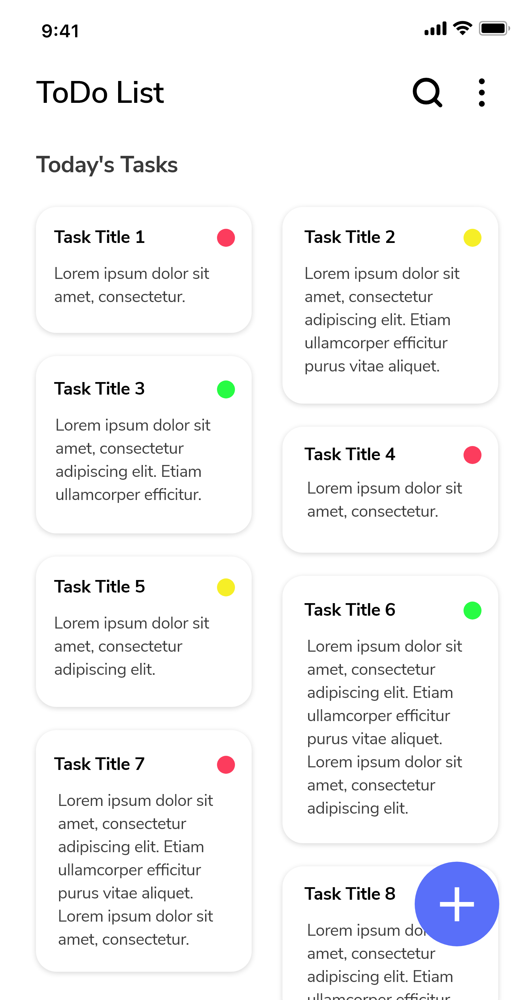
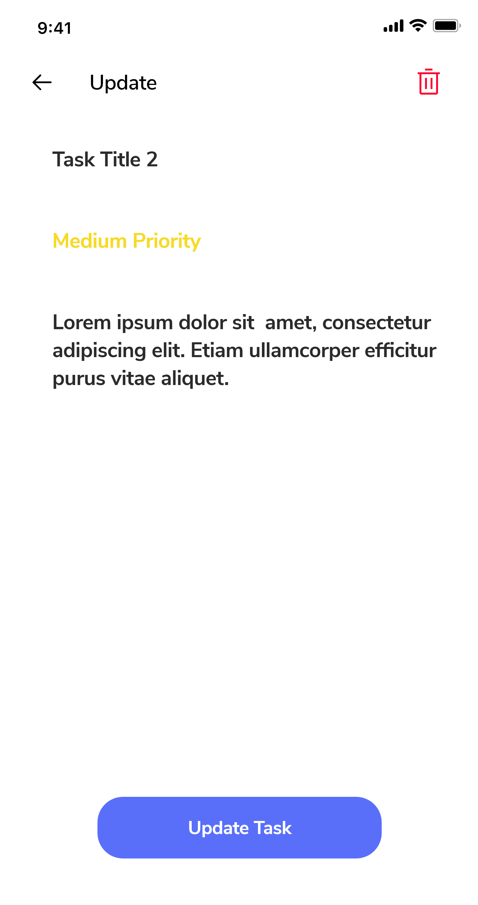
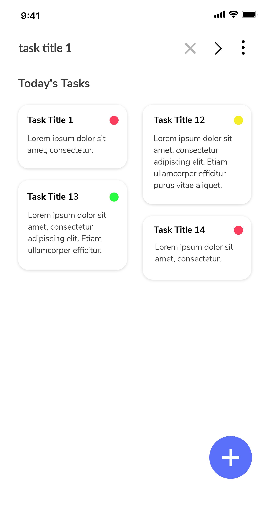
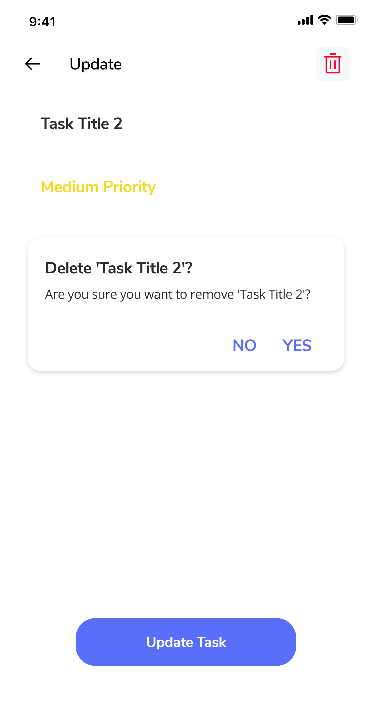

 
<h2 align="center"><b>ToDo</b></h2>
<h4 align="center">A Todo list app for android to organize and prioritize daily tasks.</h4>

## Screenshots

## Description

An Android app to organize and prioritize your daily tasks. Users can search for tasks, sort tasks by priority, and delete tasks.

## Features

* Add tasks and prioritize them
* Update tasks easily
* Sort tasks by priority
* Search tasks by title
* Delete particular task or all tasks at once

Note: The app logo is taken from the [Aura](https://dribbble.com/shots/5102086-ToDo-App-Icon) dribble page.